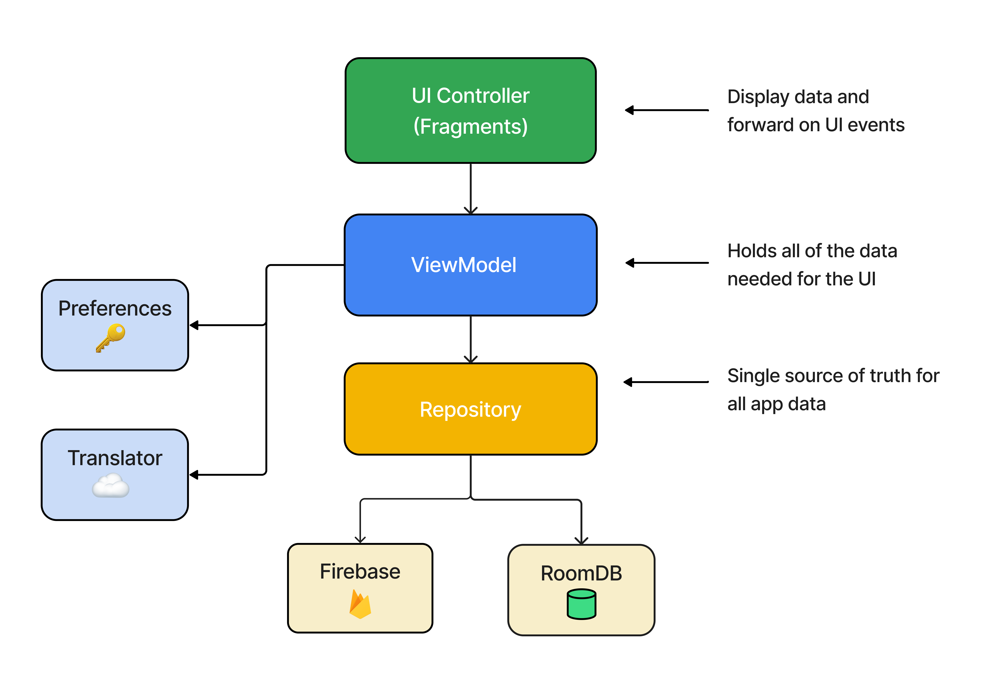

<h1 align="center">Headout</h1>

<p align="center">  
🎨 Headout's android app redesigned. The world's best experiences curated just for you! ✨
</p>

## App UI 
- Light mode
<p float="left">
   
</p>

- Dark mode
<p float="left">
   
</p>

## App User Flow
<p float="left">
   
</p>

## Demo
Watch [App Demo](https://youtu.be/vdmLdWthfpU) on Youtube.

## Download
Check out [Releases](https://github.com/ArjunJadeja/Headout/releases) to download the latest APK.

## Features
- **Caching** - Implemented for reducing network calls and enhancing performance.
- **Localization** - The app supports multiple languages, ensuring accessibility to a global user base.
- **Community** - To explore experiences of people from around the world. 
- **Customer Support** - In-app customer support to promptly assist users and address their queries or issues.
- **Save Experience** - Save favorite experiences for easy access in the future and reducing search time.
- **Dark Mode** - Reduce screen glare and enhance the overall user interface aesthetics.

## Tech stack & Open-source libraries
- **Minimum SDK level 26**
- [**Kotlin**](https://kotlinlang.org/) - Modern, concise, and safe programming language.
- [**Coroutines**](https://github.com/Kotlin/kotlinx.coroutines) - A concurrency design pattern to simplify code that executes asynchronously.
- **Jetpack**
  - **Lifecycle** - Observe Android lifecycles and handle UI states upon lifecycle changes.
  - **Navigation** - Implement navigation from simple button clicks to more complex patterns.
  - **ViewModel** - UI-related data holder that is lifecycle-aware and allows data to survive configuration changes.
  - **LiveData** - Lifecycle-aware data holder, meaning it respects the lifecycle of other app components.
  - **ViewBinding** - Binds UI components in your layouts to data sources in your app using a declarative format rather than programmatically.
  - **DataStore** - A data storage solution that allows storing key-value pairs values.
- [**Kotlin Serialization**](https://github.com/Kotlin/kotlinx.serialization) - A compiler plugin that automatically produces visitor code for classes, and a runtime library that uses generated code to serialize objects without reflection.
- [**Firebase**](https://github.com/firebase/quickstart-android) - An application development platform that helps you build, improve, and grow your app.
- [**Retrofit**](https://square.github.io/retrofit/) - A type-safe HTTP client for Android and Java.
- [**GSON Converter**](https://github.com/square/retrofit/tree/master/retrofit-converters/gson) - A converter which uses Gson for serialization to and from JSON.
- [**Glide**](https://github.com/bumptech/glide) - An image loading and caching library for Android.
- [**Shimmer**](https://facebook.github.io/shimmer-android/) - An Android library that provides an easy way to add a shimmer effect to any view in your Android app.
- [**Mobilisten**](https://www.zoho.com/salesiq/mobilisten-sdk.html) - Zoho's Mobilisten is an in-app live chat platform for proactive conversations with your app users and customers in real-time.
- [**Material 3**](https://github.com/material-components/material-components-android) - Material design components for building View layouts and Animations.


## App Architecture
MVVM architecture and the Repository pattern.
<p float="left">
   
</p>

## Credits
- Icons from [Flaticon](https://www.flaticon.com)
- Illustrations from [Iconscout](https://iconscout.com)

## License
```xml
MIT License

Copyright (c) 2022 Arjun Jadeja

Permission is hereby granted, free of charge, to any person obtaining a copy
of this software and associated documentation files (the "Software"), to deal
in the Software without restriction, including without limitation the rights
to use, copy, modify, merge, publish, distribute, sublicense, and/or sell
copies of the Software, and to permit persons to whom the Software is
furnished to do so, subject to the following conditions:

The above copyright notice and this permission notice shall be included in all
copies or substantial portions of the Software.

THE SOFTWARE IS PROVIDED "AS IS", WITHOUT WARRANTY OF ANY KIND, EXPRESS OR
IMPLIED, INCLUDING BUT NOT LIMITED TO THE WARRANTIES OF MERCHANTABILITY,
FITNESS FOR A PARTICULAR PURPOSE AND NONINFRINGEMENT. IN NO EVENT SHALL THE
AUTHORS OR COPYRIGHT HOLDERS BE LIABLE FOR ANY CLAIM, DAMAGES OR OTHER
LIABILITY, WHETHER IN AN ACTION OF CONTRACT, TORT OR OTHERWISE, ARISING FROM,
OUT OF OR IN CONNECTION WITH THE SOFTWARE OR THE USE OR OTHER DEALINGS IN THE
SOFTWARE.
```
